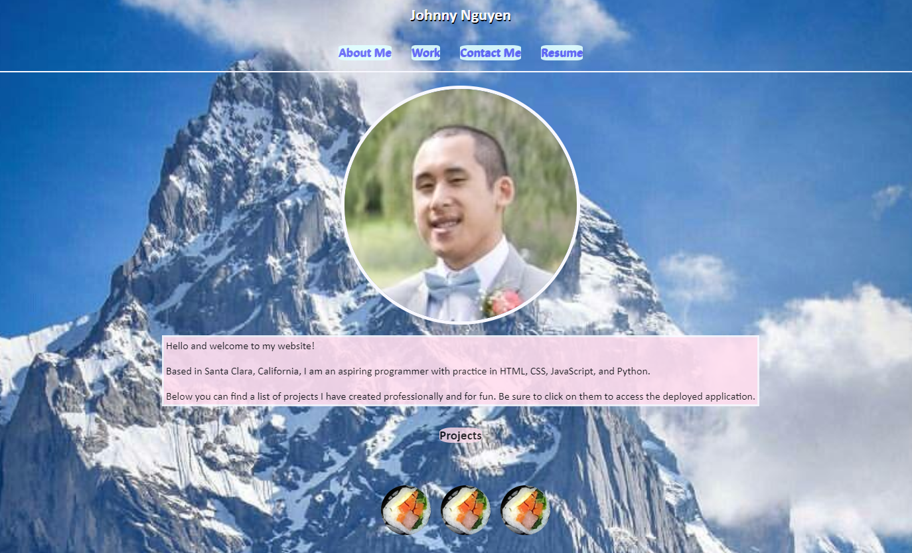

# NguyenJohnnyT.github.io

## Description

Johnny Nguyen's portfolio that contains information about him, links to his work, methods of contacting him, and resume.  Within the links to his work contain various projects and assignments that were done in the UC Berkeley bootcamp, business, and other personal ventures.

Currently (June 22, 2021), pending features of this website include links to actual project applications and ways to contact Johnny through the mobile form at the bottom of the page.  Placeholders are noted with an image of a food item.

Actual features include a functional navigation bar that directs the user to the appropriate section within the webpage, and, on hover, expanding of project images.

The code within the repository contains HTML, CSS, and image files that represent his portfolio.

## Installation

Access via this [link](https://nguyenjohnnyt.github.io) (https://nguyenjohnnyt.github.io/)

Alternatively, download repository files and open index.html.

## Usage

Within this repository are HTML, CSS and image files associated with Johnny's portfolio.  When more projects are added and can be linked, index.html can be updated to include links to those applications.

Currently, features of this website include mobile-friendliness, in-site navigation links that go to sections of the website and also temporary "project" links that enter Johnny's github profile.

Example webpage screenshot:

Example mobile demo:

## Credits

[UCB Bootcamp](https://bootcampspot.com/)\
[w3schools html](https://www.w3schools.com/html/)\
[w3schools css](https://www.w3schools.com/css/)
[stock background image](https://i.redd.it/0r435757fgm41.jpg)\

## License
